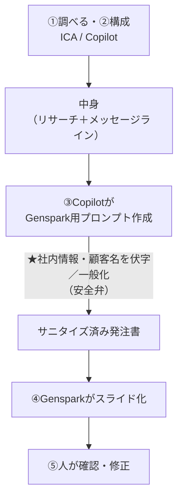

# LV1：チャットAI使い倒し 台本
### テーマ：「チャットAIで提案PPTを作る」
**ゴール：営業の提案・商談資料（PPT）を、`調べる→構成→スライド化→仕上げ` の一気通貫でAIに渡して1本作れるようになる**

> 共通ルール（安全・録画同意・進め方・記号）は [台本ガイド](index.md) を参照。レベルの位置づけは [カリキュラム設計書](../design/curriculum.md)。
> 配布教材：[LV1 リサーチ対象サンプル](../materials/lv1-research-target.md)／プロンプト型は [テンプレート集](../toolkit/index.md)

> **LV1は「PPTを作る」ための3回**（毎回テーマ＝営業業務を変えるので、複数回出ても重複しない）。調べる・書くは**PPTの前工程**として一本のワークフローに統合：
> - **LV1-a 中身をつくる**（調べる＋構成）… この台本のメイン（分刻み）／ICA・Copilot
> - **LV1-b スライドにする**（Copilotが伏字プロンプト→Genspark）… 分刻み／新しい核心
> - **LV1-c 自案件で仕上げる**（自分の担当先で一気通貫＋磨き）… §後半に進行アウトライン
>
> **渡し方の型（全レベル共通・LV1でも毎回確認）**：素材を渡す → 指示（役割・依頼・出力形式・安全弁）→ AIに作らせる → 自分で確認・仕上げ。

> **PPTパイプライン（LV1の背骨）**
> ```text
> ①調べる・②構成（ICA / Copilot）
>    ↓ 中身（リサーチ＋メッセージライン）
> ③Copilotに「Genspark用のPPT生成プロンプト」を作らせる
>    ★このとき社内情報・顧客名を伏字／一般化させる（安全弁）
>    ↓ サニタイズ済みプロンプト
> ④Gensparkがスライド化
>    ↓
> ⑤人が確認・修正
> ```
> なぜこの形か：Genspark（社外ツール）には**生の社内・顧客情報を渡さない**。社内で使えるCopilotが「一般化した指示書」に変換してから渡すので安全側に倒せる。ついでに「**プロンプトもAIに作らせる**」が身につく。



---

## LV1-a：中身をつくる（調べる＋構成をAIに渡す）— 60分・分刻み

- **今日のゴール宣言**：「終わったら、提案PPTの**中身（リサーチ＋構成案）**をチャットAIに渡して10分で用意できる。次回これをスライドにする」
- **使うツール**：ICA（深い調査・提案の下ごしらえ）／ Copilot（手早く）。両方触って違いを体感。

### 事前準備チェック
- [ ] ICA / Copilot にログイン済み（前日Forms）
- [ ] 配布：`LV1_リサーチ対象サンプル`（架空企業の概要メモ）
- [ ] 参加者へ：「自分の担当業界 or 気になる企業（**公開情報のみ・社外秘禁止**）を1つ手元に」

| 時間 | 内容 |
|---|---|
| 0:00–0:05 | チェックイン。「LV1は“チャットAIでPPTを作る”3回。今日は**中身づくり**」＋安全ルール（**リサーチは出典確認。未確認は『要確認/推測』と書かせる**） |
| 0:05–0:12 | デモ：架空企業を渡して「業界動向・想定課題・キーパーソン仮説・刺さる切り口＋**確認すべき点**」を出させる（＝PPTの素材） |
| 0:12–0:20 | 写経：配布のリサーチ対象で全員が同じ依頼を実行。ICAとCopilotの**深さ vs 速さ**を体感 |
| 0:20–0:30 | デモ：リサーチ結果を渡して「提案PPTの**構成案（メッセージライン）**」を作らせる（表紙／現状課題／打ち手／効果／次アクションの流れ） |
| 0:30–0:45 | BO①：自分の担当業界/企業（公開情報のみ）でリサーチ→構成案。「AIの結果、**どこを自分で裏取りするか**」を会話 |
| 0:45–0:52 | 共有：2名。リサーチ＆構成のプロンプトの型を板書。**次回はこの構成をスライドにする**と予告 |
| 0:52–1:00 | 保存：リサーチ＆構成プロンプトと**自分の構成案**をOneNoteへ（次回の素材）。宿題提示 |

### セリフ・操作の要点
- 🎤（0:05 デモ前）「PPTは“いきなりスライド”からは作りません。まず**中身**。リサーチはAIが一番速い作業の1つ。ただし**鵜呑みは厳禁**、最後に『確認すべき点を挙げて』を必ず付けます。」
- 🖱操作（リサーチ）：ICAに配布の架空企業概要を貼って実行。
  ```
  あなたは法人営業のリサーチ担当です。
  次の企業について、商談前に押さえるべき点を整理してください。
  ① 業界の動向と、この企業が直面しそうな課題（仮説）
  ② キーパーソン仮説（役割・関心事）
  ③ 当社が刺さりそうな切り口（仮説）
  ④ 私が事前に裏取りすべき「確認すべき点」
  推測の箇所は「推測」、不明は「要確認」と明記。事実を断定しないこと。
  ```
- 🖱操作（構成）：上の結果を渡して、PPTの骨子を作らせる。
  ```
  上のリサーチをもとに、提案PPTの構成案（メッセージライン）を作ってください。
  スライドごとに「見出し」と「一番言いたいこと（1行）」を並べる。
  流れ：表紙 → 現状と課題 → ありたい姿 → 打ち手（当社提案）→ 期待効果 → 次アクション。
  各スライドは要点3つ以内。推測・要確認は明記。
  ```
- 🎤「この“見出し＋1行”のリストが、次回そのままGensparkへの発注書になります。」
- 🧑‍🔧TA：BO①巡回。「裏取り対象（数字・固有名詞・最新動向）」を1つは挙げさせる。
- ⚠つまずき：「それっぽい嘘が混じる」→「だからリサーチは“仮説の下書き”。確認すべき点を出させて、人が裏取りする前提でOK」。
- 💬チャット（宿題）：
  ```
  【宿題：次回まで】
  次の商談用に、AIでリサーチ（①〜④）→提案PPTの構成案まで作る。
  記録：役立った点／AIが外した点（裏取りで判明）／時短できた分
  ```

- **持ち帰り成果物**：自分の担当先1社の「リサーチ＋PPT構成案（＝次回スライド化する素材）」
- **卒業（LV1全体）に近づく目安**：PPTの中身をAIに渡して素早く用意できる

---

## LV1-b：スライドにする（Copilotが伏字プロンプト→Genspark）— 60分・分刻み

- **1回完結メモ**：この回だけで完結します。**LV1-a に出ていなくてもOK**＝開始素材（PPT構成案）を配布するので、今日から来た人もそのまま今日のゴールに到達できます。
- **今日のゴール宣言**：「終わったら、構成案から**PPTを1本**（架空企業ぶん）完成できる」
- **使うツール**：まず社内ツール（Copilot/ICA）で“限界体感”→ **Genspark**（スライド生成）。Copilotは**伏字＆発注書づくり**の相棒。
- **無料枠の前提**：Gensparkは無料枠だと**1人1デック**が目安（生成回数・エクスポートに制限あり）。演習は架空企業で1本に絞る。

### 事前準備チェック
- [ ] **開始素材：PPT構成案**を手元に（連続受講の人は LV1-a で作った自分の構成案／今日から来た人は [開始素材集](../materials/starters.md) の「LV1-b の開始素材」を配布）
- [ ] Genspark にアクセスできる（無料アカウント）／エクスポート形式を確認

| 時間 | 内容 |
|---|---|
| 0:00–0:05 | チェックイン。「今日は構成を**スライド**にする」＋安全ルール（**社外ツールに生の社内/顧客情報を貼らない**） |
| 0:05–0:12 | 限界体感：Copilot/ICAに「この構成をPPTにして」と頼む→**思い通りの体裁にならない**ことを全員で体感。「じゃあ役割分担しよう」 |
| 0:12–0:22 | デモ：Copilotに「**Genspark用のPPT生成プロンプト**を作って。**社内情報・顧客名は伏字／一般化**して」と依頼→サニタイズ済み発注書を得る |
| 0:22–0:35 | デモ→写経：その発注書を**Genspark**に貼ってスライド生成→気になる所を1〜2回**修正指示**（「3枚目を図解に」「効果を数値強調」） |
| 0:35–0:48 | BO①：各自、構成案（自分の or 配布の開始素材）でCopilot発注書→Gensparkで1本。**できたら✅／詰まったら❓**。TAが巡回 |
| 0:48–0:55 | 共有：2名。**伏字/一般化がちゃんと効いているか**（顧客名・社名が残っていないか）を全員でチェックする観点を共有 |
| 0:55–1:00 | 保存：発注書プロンプトをOneNoteへ。宿題提示（次回=自案件） |

### セリフ・操作の要点
- 🎤（0:05）「Copilotに直接“かっこいいPPT作って”は、実は苦手。でも**指示書を書くのは得意**。だから**Copilotが指示書、Gensparkが清書**、と分けます。」
- 🖱操作（伏字プロンプト生成／Copilot）：
  ```
  次の提案の構成案から、スライド生成ツール（Genspark）に貼る「PPT生成プロンプト」を作ってください。
  条件：
  ・社名・顧客名・個人名・具体的な社内数値は【業種】【A社】【約N名】のように伏字／一般化する
  ・各スライドの見出しと要点（3つ以内）、推奨レイアウト（表紙/箇条書き/図解/数値強調）を指定
  ・トーンは法人営業の提案向け・簡潔
  出力はそのまま貼れる1ブロックのプロンプトにしてください。
  ---
  {構成案を貼る（自分の or 配布の開始素材）}
  ```
- 🖱操作（Genspark）：出てきたプロンプトを貼って生成→「◯枚目を図解に」「効果は数値を大きく」等で**修正**。
- 🎤「無料枠なので**作り直しは節約**。修正指示で直すのが基本。今日は1本仕上げればOK。」
- 🧑‍🔧TA：BO①巡回。**伏字漏れ**（実社名・実顧客名が残っていないか）を必ず1回チェックさせる。
- ⚠つまずき：「Gensparkの体裁が崩れる」→「発注書の**レイアウト指定**を足す／枚数を絞る」。「無料枠が尽きた」→「今日は生成済みを修正で仕上げ、続きは宿題で」。
- 💬チャット（宿題）：
  ```
  【宿題：次回まで】
  今日の流れ（構成→Copilotで伏字発注書→GensparkでPPT）を、架空でもう1本 or 自分の案件の下ごしらえで試す。
  記録：伏字はうまくいったか／体裁で困った点／時短できた分
  ```

- **持ち帰り成果物**：架空企業の**提案PPT 1本**＋再利用できる「伏字発注書プロンプト」
- **卒業（LV1全体）に近づく目安**：構成→伏字発注書→Gensparkで、体裁の整ったPPTを自分で出せる

---

## LV1-c：自案件で仕上げる（一気通貫＋磨き）— 60分・分刻み（現時点の案）

- **1回完結メモ**：この回だけで完結します。**LV1-a/b に出ていなくてもOK**＝再利用する「リサーチ＆構成／伏字発注書」プロンプト一式を配布するので、今日から来た人も通しを体験できます。
- **今日のゴール宣言**：「終わったら、**自分の担当先の提案PPTドラフト1本**を、`調べる→構成→伏字発注書→Genspark→修正` の通しで作れる」
- **使うツール**：ICA / Copilot（中身・発注書）＋ Genspark（スライド化）。`調べる→構成→伏字発注書→Genspark→修正` の通しを、**この1回で完結体験**する回。
- **鉄則**：自案件は必ず **Copilotで伏字／一般化してからGensparkへ**（生の顧客情報を社外ツールに入れない）。

### 事前準備チェック
- [ ] **開始素材：リサーチ＆構成／伏字発注書プロンプト一式**を手元に（連続受講の人は LV1-a/b で保存した自分の分／今日から来た人は [開始素材集](../materials/starters.md) の「LV1-c の開始素材」を配布）
- [ ] 自分の**進行中 or 直近の担当案件**を1つ（社外秘は伏せる前提でOK。案件が無い人は配布のみらい製作所ブリーフで可）
- [ ] Genspark にログイン済み（無料枠＝1人1デック目安）

| 時間 | 内容 |
|---|---|
| 0:00–0:05 | チェックイン。「今日は**自分の案件で一気通貫**。前2回の型を通すだけ」＋安全ルール（**生の顧客情報はGensparkに貼らない＝必ずCopilotで一般化**） |
| 0:05–0:14 | デモ：講師が自案件想定で通しを早回し（①ICAリサーチ→②Copilot構成→③Copilot伏字発注書→④Genspark→⑤確認）。各工程は前2回の型を**再利用**することを強調 |
| 0:14–0:24 | 写経：全員、自分の案件で①リサーチ→②構成案まで。「AIの結果のうち**裏取りする点**」を1つ以上メモ |
| 0:24–0:42 | BO①：自案件で③伏字発注書→④GensparkでPPT 1本。ペアで「**伏字が効いているか**（実社名・顧客名が残っていないか）」「メッセージが刺さるか」を相互チェック |
| 0:42–0:50 | 磨き：Gensparkへの修正指示で体裁・図解・数値強調を整える。**表紙とサマリー1枚**を仕上げる |
| 0:50–0:56 | 共有：2名の自案件PPTを画面提示。良かった発注書の書き方・伏字の工夫を横展開 |
| 0:56–1:00 | 保存：完成PPTと「自案件で通した手順メモ」をOneNoteへ。宿題提示 |

### セリフ・操作の要点
- 🎤（0:05）「今日は新しい技はありません。**型を、自分の案件で通す**だけ。詰まったら配布の[開始素材集]のプロンプトを再利用してOK（前回の自分の保存分があればそれで）。」
- 🖱操作（一気通貫の再利用）：「リサーチ＆構成」プロンプト → 「伏字発注書」プロンプト → Genspark、と**保存済み or 配布の開始素材集**のプロンプトを順に貼る。
- ⚠つまずき：「自案件だと伏字が漏れそうで怖い」→「**Copilotの一般化を必ず1回挟む**。発注書に実社名が残っていないか、貼る前に自分の目で確認」。
- ⚠つまずき：「無料枠が尽きた」→「修正指示で仕上げ、残りは宿題。デックは1本に絞る」。
- 🧑‍🔧TA：BO①巡回。**伏字漏れチェック**を各自に必ず1回させる（実社名・顧客名・生の数値）。
- 💬チャット（宿題）：
  ```
  【宿題：次回まで】
  今日仕上げた自案件PPTを、1週間以内に実案件で使う（or 上長レビューに出す）。
  記録：使った場面／相手の反応／AIで時短できた分／直した点
  ```

- **持ち帰り成果物**：自分の担当先の**提案PPTドラフト1本**（伏字済み）＋再利用できる一気通貫の手順メモ
- **卒業（LV1全体）に近づく目安**：自案件を `調べる→構成→伏字発注書→Genspark→仕上げ` で自分のプロンプトだけで1本作れる

---

### LV1 共通：宿題と卒業条件
- **宿題（毎週）**：日常業務でAIを使う。特に**提案・資料づくりは「調べる→構成→伏字発注書→Genspark」**の型で回す。記録（使った業務／効いた点／詰まった点）。
- **卒業条件**：自分の実案件の提案PPTを、**リサーチ→構成→スライド化→仕上げ**まで自分のプロンプトで1本作れる（社内/顧客情報は必ず伏字してGensparkへ）。→ 診断で LV2（Bobで“動くデモ”）へ。
