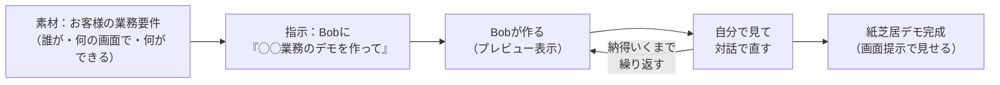

# LV2：Bobでデモ 台本
### テーマ：「Bobで、お客様に“見せられる”デモを作る」
**ゴール：Bobに自然言語で頼んで、お客様に画面で見せられる“紙芝居”デモを1本作れる**

> 共通ルール（安全・進め方・記号）は [台本ガイド](index.md) を参照。レベルの位置づけは [カリキュラム設計書](../design/curriculum.md)。
> 配布教材：[LV2 デモ業務テーマ](../materials/lv2-demo-theme.md)

> **Bobとは**：IBM製の **VSCode風IDE**。組み込みLLM（自動選択）で、コードが書けなくても **自然言語で「作って」と頼むと作ってくれる**（バイブコーディング）。<https://bob.ibm.com/>
> **LV2の狙い**：完璧なアプリは要らない。**紙芝居レベルの画面プロト／対話デモ**で「こんな感じ」をお客様に体感させる。見せ方は **画面提示（画面共有）でOK**（静的ページをGitHub等に公開して共有するのは [エクストラ] で扱う）。
> **渡し方の型（LV2版）**：素材＝お客様の業務要件（対話で固める）→ 指示＝「◯◯業務のデモを作って」→ Bobが作る → 自分で見て **対話で直す**。

> **LV2の3つの引き出し**（毎回テーマを変えて複数回）：
> - **LV2-a 入門＋初めての1本**（この台本のメイン・分刻み）
> - **LV2-b 自分の案件でデモ制作**（分刻み）
> - **LV2-c 磨き・お客様への見せ方**（分刻み）

> **デモ制作フロー（LV2の背骨）**


---

## LV2-a：Bob入門＋初めてのデモを作る — 60分・分刻み

- **今日のゴール宣言**：「終わったら、Bobに話しかけて、お客様に画面で見せられるデモを1本作れる。**今日はコードを書きません**」
- **使うツール**：Bob（VSCode風IDE／自然言語でバイブコーディング）

### 事前準備チェック
- [ ] Bob にアクセス／ログインできる（前日Forms）
- [ ] 配布：`LV2_デモ業務テーマ`（架空の業務シナリオ）
- [ ] 参加者へ：「お客様の**実データは入れない**。架空データ・架空業務で作る」

| 時間 | 内容 |
|---|---|
| 0:00–0:05 | チェックイン＆ゴール。「今日はコードを書かず、話しかけて作ります」＋安全（架空データのみ） |
| 0:05–0:14 | デモ：Bobに「◯◯業務のデモ画面を作って」と入力 → 対話で要件を詰める → プレビュー表示 → 「ここをこう変えて」で修正 |
| 0:14–0:24 | 写経：全員、配布の同じ業務テーマでBobにデモを作らせ、プレビューを出す |
| 0:24–0:39 | BO①：自分の担当業務/案件のデモ（架空データ）をBobで作る。ペアで「お客様だったらどこに反応する?」 |
| 0:39–0:48 | 共有：2名のデモを画面提示。**良いデモの条件**＝1画面で価値が伝わる・紙芝居で十分 |
| 0:48–0:55 | 磨き＆見せ方：「もっとシンプルに」と対話修正＋“デモは語りながら見せる”コツ |
| 0:55–1:00 | 保存：再現手順（何を打ったか）をメモ。宿題提示 |

### セリフ・操作の要点
- 🎤（0:00）「Bobは、コードが書けなくても“こういうの作って”と話しかけると作ってくれるIDEです。**今日の主役はみなさんの言葉**。」
- 🖱操作（デモ）：Bobの対話に次のように入力。
  ```
  在庫管理業務の、担当者が使う簡単なデモ画面を作って。
  一覧画面と「登録」ボタンがある感じで。まずはざっくりでOK。
  ```
  → 出たら対話で修正：`登録ボタンを押したら入力フォームが出るようにして` ／ `色をもう少し明るく` など。
- 🎤「**コードは見なくて大丈夫**。気に入らなければ“違う、こうしたい”と話せば直ります。これがBob流。」
- 🧑‍🔧TA：BO①巡回。「凝りすぎ」を止める＝「今日は紙芝居でOK。**完璧より“見せられる”**」。
- ⚠つまずき：「思った画面と違う」→「対話で“こう変えて”と頼めばOK。1発で完成しなくていい」。
- ⚠つまずき：「何を作らせるか決まらない」→「配布テーマでOK。お題は『◯◯業務のデモを作って』の1行から」。
- 💬チャット（宿題）：
  ```
  【宿題：次回まで】
  次の提案機会で、Bobでデモを1本作って、お客様（or 上司）に画面で見せる。
  記録：作った業務／相手の反応／対話で直した回数
  ```

- **持ち帰り成果物**：お客様に画面提示できる紙芝居デモ1本
- **卒業（LV2）に近づく目安**：自分の案件のデモを、対話だけで“見せられる形”にできる

---

## LV2-b：自分の案件でデモ制作 — 60分・分刻み（現時点の案）

- **1回完結メモ**：この回だけで完結します。**LV2-a に出ていなくてもOK**＝要件を「誰が・何の画面で・何ができる」の3点で言葉にすれば、その場で Bob に発注できます。題材が無い人は開始素材を配布。
- **今日のゴール宣言**：「終わったら、**自分の提案案件（架空データ）に合わせたデモ**を1本仕上げられる」
- **使うツール**：Bob（自然言語でバイブコーディング）
- **鉄則**：要件は「**誰が・何の画面で・何ができる**」の3点で言葉にしてから頼む（お客様の実データは入れない＝架空データ）。

### 事前準備チェック
- [ ] **開始素材：要件3点シート**を手元に（連続受講の人は LV2-a のデモ／今日から来た人は [開始素材集](../materials/starters.md) の「LV2-b の開始素材」＝要件3点＋デモ業務テーマ）
- [ ] 自分の提案機会を1つ（**架空データ化**して持ち込む。無い人は配布のみらい製作所テーマで可）
- [ ] Bob にログイン済み

| 時間 | 内容 |
|---|---|
| 0:00–0:05 | チェックイン。「今日は**自分の案件のデモ**を1本」＋安全（架空データのみ） |
| 0:05–0:14 | デモ：講師が「誰が・何の画面で・何ができる」の3点を**対話で固める**→Bobに渡す→画面プロト。要件を言葉にする過程を見せる |
| 0:14–0:24 | 写経：全員、自分の案件の要件3点を書き出す→Bobに1行で発注→プレビューを出す |
| 0:24–0:42 | BO①：自分の案件で制作。ペアで「**この画面、刺さる? 足りない?**」レビュー→対話で1〜2か所直す |
| 0:42–0:50 | 仕上げ：**見せる順番（紙芝居の順）**を決める。「最初に見せる1画面」を選ぶ |
| 0:50–0:56 | 共有：2名。要件3点の書き方の良い例を横展開 |
| 0:56–1:00 | 保存：再現手順（何を打ったか）と紙芝居の順をメモ。宿題提示 |

### セリフ・操作の要点
- 🎤（0:05）「いきなり『作って』の前に、**誰が・何の画面で・何ができる**の3点だけ決めます。ここが決まればBobは一瞬です。」
- 🖱操作（要件を固める）：Bobに次のように。
  ```
  提案用のデモを作りたい。まず要件を一緒に整理して。
  ・誰が使う：{例）現場の在庫担当}
  ・何の画面：{例）在庫の一覧と登録}
  ・何ができる：{例）検索して、登録して、アラートが出る}
  この3点で、まずは紙芝居レベルの画面を作って。
  ```
- 🧑‍🔧TA：BO①巡回。「要件3点が曖昧なまま作り始めていないか」を見る。曖昧なら3点に戻す。
- ⚠つまずき：「案件が固有情報だらけ」→「**架空データに置き換え**。業種と機能だけ残せばデモは成立する」。
- 💬チャット（宿題）：
  ```
  【宿題：次回まで】
  今日のデモを、実際の提案機会で1回見せる（架空データのまま画面提示でOK）。
  記録：見せた相手／反応／要件3点は合っていたか
  ```

- **持ち帰り成果物**：自分の案件に合わせた紙芝居デモ1本＋見せる順番メモ
- **卒業（LV2）に近づく目安**：自分の案件のデモを、要件3点から対話だけで“見せられる形”にできる

---

## LV2-c：磨き・お客様への見せ方 — 60分・分刻み（現時点の案）

- **1回完結メモ**：この回だけで完結します。**LV2-a/b に出ていなくてもOK**＝磨く対象のデモは開始素材の再現手順から数分で用意できます。今日の主役は「見せ方・語り方」。
- **今日のゴール宣言**：「終わったら、デモを**『語りながら見せる』**状態にできる（各画面を1文で説明＋想定質問に即興で返せる）」
- **使うツール**：Bob（最終磨き）＋自分の言葉（トーク）
- **鉄則**：磨きは**やりすぎない**。紙芝居で十分＝「動かない所は『本番ではこうなります』」でOK。

### 事前準備チェック
- [ ] **開始素材：磨く対象のデモ**を手元に（連続受講の人は LV2-a/b のデモ／今日から来た人は [開始素材集](../materials/starters.md) の「LV2-c の開始素材」＝再現手順で作り直し）
- [ ] 「このデモは何の課題を解くか」を1文で考えてくる

| 時間 | 内容 |
|---|---|
| 0:00–0:05 | チェックイン。「今日は**見せ方・語り方**の回。デモ＋トークをセットにする」 |
| 0:05–0:14 | デモ：講師が既存デモを画面提示しながら、各画面で「**これは何の課題を解くか**」を1文で語る実演。「動かない所」の逃がし方も見せる |
| 0:14–0:24 | 写経：各自、自分のデモの各画面に**1文キャプション**を付ける（口で言えるように） |
| 0:24–0:39 | BO①：ペアで**デモ＋トークの通し**を相互に見せ合う→「どこで反応した?／どこが分かりにくい?」FB |
| 0:39–0:48 | 想定質問への即興練習：「ここは実際どう動く?」→「**本番ではこうなります**」と返す型を全体で練習 |
| 0:48–0:55 | 磨き：Bobに「もっとシンプルに」等の対話修正を**1〜2回だけ**（やりすぎ注意） |
| 0:55–1:00 | 保存：トークスクリプト（各画面1文）をメモ。宿題提示。※公開して**URLで渡したい人は[エクストラ]**へ誘導 |

### セリフ・操作の要点
- 🎤（0:05）「デモは黙って見せても伝わりません。**語りながら見せる**。各画面で『これは◯◯の課題を解きます』と1文言えれば十分。」
- 🎤（想定質問）「『ここ実際どう動くの?』と聞かれたら、無理に作り込まず『**本番ではこうなります**』でOK。紙芝居の強みです。」
- 🧑‍🔧TA：BO①巡回。**凝りすぎ**を止める（磨きは1〜2回まで）。トークが詰まる人には1文キャプションを一緒に作る。
- ⚠つまずき：「説明が長くなる」→「各画面**1文だけ**。詳細は聞かれてから」。
- ※静的ページをGitHub等に公開してリンク共有したい人は [エクストラ] へ。
- 💬チャット（宿題）：
  ```
  【宿題：次回まで】
  デモ＋トークを、実際の提案機会で1回披露する。
  記録：相手の反応／即興で返せた質問／もっと磨きたい所
  ```

- **持ち帰り成果物**：語りながら見せられるデモ＋各画面1文のトークスクリプト
- **卒業（LV2）に近づく目安**：デモを画面提示しながら、各画面の価値を1文で語り、想定質問に落ち着いて返せる

---

### LV2 共通：宿題と卒業条件
- **宿題（毎週）**：提案・商談機会でBobデモを1本作って見せる。記録（業務／反応／直した回数）。
- **卒業条件**：お客様前で見せられるデモを Bob で **1本作れる**（紙芝居レベル・画面提示でOK）（→ 診断で LV3 へ）。
