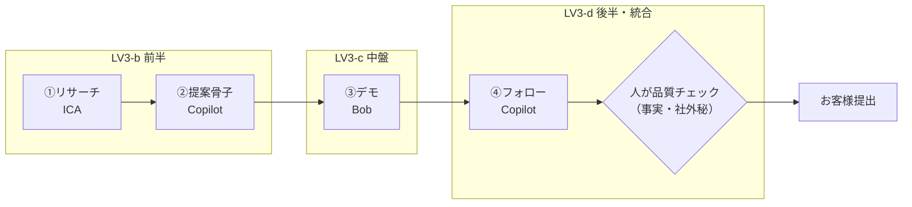

# LV3：使い分け 台本
### テーマ：「案件まるごとを、AIを使い分けて回す」
**ゴール：1つの案件を リサーチ→提案→デモ→フォロー まで、ICA / Copilot / Bob を使い分けて一周できる**

> 共通ルール（安全・録画同意・進め方・記号）は [台本ガイド](index.md) を参照。レベルの位置づけは [カリキュラム設計書](../design/curriculum.md)。
> 配布教材：[LV3 案件ブリーフ](../materials/l3-brief.md)

> **LV3の狙い**：新しい技を覚えるのではなく、**今までの技（LV1チャットAI／LV2 Bobデモ）を“どの業務にどれを使うか”判断して、案件を最後まで回す**。差がつくのは速さだけでなく **品質管理の目**（顧客提出物の事実確認）。
> **使い分けの基本**：①調べる=ICA/Copilot ／ ③書く=Copilot ／ ④見せる(デモ)=Bob ／ 会議=Copilot。渡し方の型は全部同じ（素材→指示→AIに作らせる→人が確認・仕上げ）。

> **LV3の4つの引き出し**（毎回テーマを変えて複数回）：
> - **LV3-a 使い分けの地図＋案件を1周**（この台本のメイン・分刻み）
> - **LV3-b 案件前半（リサーチ→提案）**（分刻み）
> - **LV3-c 案件中盤（デモ→提案資料）**（分刻み）
> - **LV3-d 案件後半・統合（フォロー→クロージング＋品質管理）**（分刻み）

> **案件1周フロー（LV3の背骨）**：LV3-b/c/d はこの1周を前半／中盤／後半に分けて深掘りする。


---

## LV3-a：使い分けの地図＋案件を1周 — 60分・分刻み

- **今日のゴール宣言**：「終わったら、1つの案件を **リサーチ→提案→デモ→フォロー** までAIを使い分けて一周できる。**どの段でどのAIか**を自分で判断できる」
- **使うツール**：ICA（調査・提案の下ごしらえ）／ Copilot（文章・会議・Excel）／ Bob（デモ）。

### 事前準備チェック
- [ ] ICA / Copilot / Bob すべてにログイン済み（前日Forms）
- [ ] 配布：`LV3_案件ブリーフ`（架空案件一式）
- [ ] 参加者へ：「自分の進行中の案件（**架空データ化**）を1つ手元に」

| 時間 | 内容 |
|---|---|
| 0:00–0:05 | チェックイン＆ゴール。「今日は1案件をまるごと一周」＋安全/録画ルール |
| 0:05–0:14 | デモ：講師が案件ブリーフで一周を早回し実演。①ICAリサーチ→②Copilot提案骨子→③Bobデモ→④Copilotフォロー。各段で**「なぜこのAIか」**を一言 |
| 0:14–0:24 | 写経：配布ブリーフで全員が ①リサーチ(ICA)→②提案骨子(Copilot) まで回す |
| 0:24–0:39 | BO①：自分の案件（架空）で①〜②を回す。ペアで「**どのAIをどこで使った? ズレてない?**」を確認 |
| 0:39–0:48 | 共有：**使い分けの判断軸**を全体で言語化（業務→AIの表）＋**品質管理**の一言 |
| 0:48–0:55 | 応用：残りの段（③デモ=Bob／④フォロー=Copilot）を各自で繋ぎ、一周の感覚をつかむ |
| 0:55–1:00 | 保存：自分の「案件まるごと手順（どの段でどのAI）」をメモ。宿題提示 |

### セリフ・操作の要点
- 🎤（0:05）「LV3は新しい魔法を覚える回じゃありません。**持っている技を“使い分ける”回**。今日のゴールは、案件を最後まで一周させること。」
- 🖱操作（デモ・各段の一言）：
  - ① **ICA**「深い調査と提案の下ごしらえはICA」→ 案件ブリーフでリサーチ。
  - ② **Copilot**「文章・骨子・会議はCopilot」→ 提案の骨子（課題→解決→効果→次アクション）。
  - ③ **Bob**「見せるならBobで紙芝居デモ」→ 提案を体感させる画面。
  - ④ **Copilot**「フォローメール・議事はCopilot」→ 次アクション付きの返信。
- 🖱/💬 共有：使い分けの地図を提示。
  ```
  調べる（リサーチ）      → ICA / Copilot
  書く（メール・骨子・議事）→ Copilot
  見せる（デモ）          → Bob
  まるごと回す＝上を順に、最後は人が品質チェック
  ```
- 🎤（0:39 品質）「上級の価値は速さだけじゃない。**お客様に出す前に、事実・数字・固有情報を人が確認する**。ここがプロの差です。」
- 🧑‍🔧TA：BO①巡回。「ツール選択がズレてないか（例：デモをCopilotで無理してないか）」を見る。
- ⚠つまずき：「どのAIか迷う」→「地図に戻る：調べる=ICA、書く=Copilot、見せる=Bob」。
- 💬チャット（顧客提出前チェックリスト）：
  ```
  □ 事実・数字の裏取り（出典確認）
  □ 顧客固有情報が正しく反映
  □ 社外秘・他社情報の混入なし
  □ 自社のトーン＆ブランドに整合
  □ 最終判断・責任は人間が持つ
  ```
- 💬チャット（宿題）：
  ```
  【宿題：次回まで】
  実案件を1件、リサーチ→提案→デモ→フォローのうち2段以上をAIを使い分けて回す。
  記録：どの段でどのAI／品質チェックで直した点／短縮できた時間
  ```

- **持ち帰り成果物**：自分の案件1件の「まるごと手順（段×AI）」＋一周した成果
- **卒業（LV3）に近づく目安**：1案件をリサーチ→提案→デモ→フォローまで使い分けて回せる

---

## LV3-b：案件前半（リサーチ→提案）— 60分・分刻み（現時点の案）

- **今日のゴール宣言**：「終わったら、自分の案件の**入口（リサーチ→提案骨子→一言サマリー）**をAIを使い分けて深く作れる」
- **使うツール**：ICA（深いリサーチ）／ Copilot（提案骨子）
- **鉄則**：リサーチは**仮説の下書き**。数字・固有名詞は人が裏取り（プロンプトに「無いことは要確認・事実を作らない」）。

### 事前準備チェック
- [ ] ICA / Copilot にログイン済み
- [ ] 自分の案件（**架空データ化**）を1つ

| 時間 | 内容 |
|---|---|
| 0:00–0:05 | チェックイン。「今日は**案件の前半**＝リサーチと提案の骨子」＋安全/録画ルール |
| 0:05–0:14 | デモ：ICAで深いリサーチ（業界・課題・キーパーソン仮説）→**なぜICAか**を一言→Copilotで「課題→解決→効果→次アクション」の骨子 |
| 0:14–0:24 | 写経：配布ブリーフでリサーチ(ICA)→骨子(Copilot)を通す。**裏取りする点**を1つ挙げる |
| 0:24–0:42 | BO①：自分の案件で前半を作る。ペアで「**課題仮説、刺さってる?**」「どこを裏取りする?」 |
| 0:42–0:52 | 仕上げ：提案の**一言サマリー（エレベーターピッチ）**をCopilotと作る |
| 0:52–1:00 | 保存：リサーチ＆骨子プロンプトと自案件の骨子をメモ。宿題提示 |

### セリフ・操作の要点
- 🎤（0:05）「前半で決まるのは**課題仮説の鋭さ**。ここが浅いと後の提案もデモも刺さりません。ICAで深く調べ、Copilotで骨子に落とす。」
- 🖱操作（骨子／Copilot）：
  ```
  次のリサーチをもとに、提案の骨子を作って。
  流れ：課題（仮説）→ 解決の方向性 → 期待効果 → 次アクション。
  各項目は要点3つ以内。推測は「推測」、裏取りが要る点は「要確認」と明記。
  最後に、30秒で言える一言サマリー（エレベーターピッチ）も1つ。
  ```
- 🧑‍🔧TA：BO①巡回。「ツール選択のズレ（リサーチをCopilotだけで浅く済ませていないか）」を見る。
- ⚠つまずき：「課題仮説が一般論すぎる」→「ICAに**この企業固有の事情**を足して聞き直す。出典も出させる」。
- 💬チャット（宿題）：
  ```
  【宿題：次回まで】
  実案件1件で、リサーチ(ICA)→提案骨子(Copilot)→一言サマリーまで作る。
  記録：どこを裏取りしたか／課題仮説は刺さったか／時短できた分
  ```

- **持ち帰り成果物**：自案件の「リサーチ＋提案骨子＋一言サマリー」
- **卒業（LV3）に近づく目安**：案件の入口をICA/Copilotで深く作り、裏取り点を自分で言える

---

## LV3-c：案件中盤（デモ→提案資料）— 60分・分刻み（現時点の案）

- **今日のゴール宣言**：「終わったら、**見せる×書く**の合わせ技で、デモと提案資料のメッセージを揃えて作れる」
- **使うツール**：Bob（デモ）／ Copilot（提案資料・想定Q&A）
- **鉄則**：デモと資料で**同じメッセージ**を言う（バラバラだとお客様が混乱）。デモは架空データ。

### 事前準備チェック
- [ ] LV3-b の提案骨子を手元に
- [ ] Bob / Copilot にログイン済み

| 時間 | 内容 |
|---|---|
| 0:00–0:05 | チェックイン。「今日は**案件の中盤**＝デモと提案資料を繋ぐ」＋安全ルール |
| 0:05–0:14 | デモ：前半の骨子から Bob で紙芝居デモ → Copilot で提案書ドラフト・想定Q&A。**なぜこの段でこのAIか**を一言 |
| 0:14–0:24 | 写経：配布ブリーフでデモ(Bob)→提案書ドラフト(Copilot)を1往復 |
| 0:24–0:42 | BO①：自分の案件でデモ＋資料を繋ぐ。ペアで「**デモと資料、同じことを言ってる?**」 |
| 0:42–0:52 | 整合：デモと資料のメッセージを揃える（キーメッセージ1文を両方に通す） |
| 0:52–1:00 | 保存：デモ再現手順＋提案書ドラフトをメモ。宿題提示 |

### セリフ・操作の要点
- 🎤（0:05）「中盤は**具体（デモ）と抽象（資料）の両輪**。Bobで体感させ、Copilotで文書化する。両方で同じ一言を言えれば強い。」
- 🖱操作（提案資料／Copilot）：
  ```
  次の提案骨子とデモ内容から、提案書のドラフトと想定Q&Aを作って。
  ・提案書：課題→解決→効果→次アクションの順、各章の見出しと要点
  ・想定Q&A：お客様が聞きそうな質問5つと回答案
  推測・要確認は明記。社外秘・他社情報は入れない。
  ```
- 🧑‍🔧TA：BO①巡回。「デモと資料のメッセージがズレていないか」を見る。
- ⚠つまずき：「デモに時間をかけすぎ」→「紙芝居でOK（LV2の型）。中盤の主眼は**デモと資料の整合**」。
- 💬チャット（宿題）：
  ```
  【宿題：次回まで】
  実案件で、デモ(Bob)＋提案資料(Copilot)を作り、キーメッセージを揃える。
  記録：デモと資料は揃ったか／想定Q&Aで役立った点／時短できた分
  ```

- **持ち帰り成果物**：メッセージの揃ったデモ＋提案書ドラフト＋想定Q&A
- **卒業（LV3）に近づく目安**：デモと資料を1本のメッセージで繋げられる

---

## LV3-d：案件後半・統合（フォロー→クロージング＋品質）— 60分・分刻み（現時点の案）

- **今日のゴール宣言**：「終わったら、**クロージングまでのフォロー文＋品質チェック**を通せる。案件を最初から最後まで一周した状態になる」
- **使うツール**：Copilot（フォロー・見積・稟議サポート文）＋**顧客提出前チェックリスト（人が最終判断）**
- **鉄則**：**お客様に出す前に必ず品質チェック**（事実・数字・固有情報・社外秘）。最終責任は人間。

### 事前準備チェック
- [ ] LV3-b/c の骨子・デモ・提案資料を手元に（一周の後半を繋ぐ）
- [ ] Copilot にログイン済み

| 時間 | 内容 |
|---|---|
| 0:00–0:05 | チェックイン。「今日で**案件を一周**。後半＝フォローとクロージング、そして品質管理」＋安全ルール |
| 0:05–0:16 | デモ：商談後フォローメール／想定反論への切り返し／稟議用サマリーをCopilotで作る |
| 0:16–0:26 | 写経：配布ブリーフでフォローメール＋稟議サマリーを作る |
| 0:26–0:37 | BO①：自分の案件で後半（フォロー→クロージング文）を作り、b/c と繋いで**一周を完成** |
| 0:37–0:50 | **品質**：顧客提出前チェックリストを全員で**実走**（自分の成果物を1つ通す）。1つは必ず修正点を見つける |
| 0:50–0:56 | 共有：一周してみての気づき・品質チェックで直した点を2名 |
| 0:56–1:00 | 保存：一周の全手順（段×AI）とチェックリストをメモ。**卒業課題**提示 |

### セリフ・操作の要点
- 🎤（0:37 品質）「上級の価値は速さだけじゃない。**お客様に出す前に、事実・数字・固有情報を人が確認する**。ここがプロの差です。AIの出力は必ず一度、人の目を通す。」
- 🖱操作（フォロー／Copilot）：
  ```
  商談後のフォローメールと、稟議用サマリーを作って。
  ・フォロー：お礼→合意事項の確認→次アクションと期限
  ・想定反論（例：価格/効果/導入負荷）への切り返しを各1つ
  ・稟議サマリー：目的・効果・費用感・リスクを簡潔に
  推測・要確認は明記。社外秘・他社情報は入れない。
  ```
- 💬チャット（顧客提出前チェックリスト）：
  ```
  □ 事実・数字の裏取り（出典確認）
  □ 顧客固有情報が正しく反映
  □ 社外秘・他社情報の混入なし
  □ 自社のトーン＆ブランドに整合
  □ 最終判断・責任は人間が持つ
  ```
- 🧑‍🔧TA：品質実走を巡回。「チェックリストを飛ばして提出しようとしていないか」を必ず止める。
- ⚠つまずき：「フォローが定型的すぎる」→「合意事項と次アクションを**この案件の固有名詞**で具体化」。
- 💬チャット（宿題＝卒業課題）：
  ```
  【宿題：卒業課題】
  実案件を1件、リサーチ→提案→デモ→フォローまで一周し、提出前に品質チェックを通す。
  記録：段×AI／品質チェックで直した点／一周にかかった時間
  ```

- **持ち帰り成果物**：案件1周ぶんの成果（フォロー・稟議サマリー含む）＋品質チェック済みの提出物
- **卒業（LV3）に近づく目安**：1案件を最後まで一周し、提出前チェックを自分で通せる（→ 希望者は [エクストラ] へ）

---

### LV3 共通：宿題と卒業条件
- **宿題（毎週）**：実案件でAIを使い分けて回す（記録：段×AI／品質で直した点／時短）。
- **卒業条件**：1案件を **リサーチ→提案→デモ→フォロー** まで ICA/Copilot/Bob を使い分けて回せる（→ 希望者は [エクストラ] でBobアプリ制作へ）。
